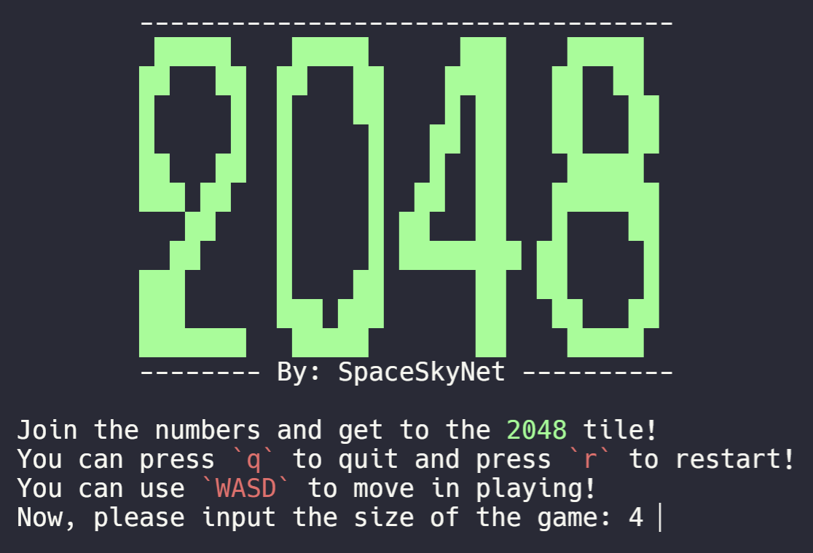
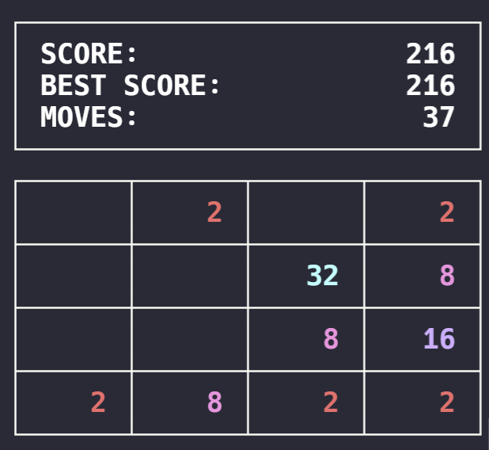

# 2048.c

Console version of the game "2048" written in C, available on Windows 10 and GNU/Linux.

<details>
<summary></summary>
There is a 2048 question in the data structure after-school exercise. After writing this question, the core functions of moving and merging have actually been implemented. I thought about changing it to a game by the way, and then there is this...

数据结构课后练习有个 2048 的题。写完这题其实就已经实现了移动和合并的核心功能，我想着就顺便改成游戏算了，然后就有了这个……
</details>

<details>
<summary>Preview</summary>




</details>


### Requirements

- C compiler

Tested on: GNU/Linux, Windows 10.

Previous Versions for Windows May not Support **ANSI escape codes** (Color Support).

### Installation

```shell
git clone https://github.com/spaceskynet/2048.c
cd 2048.c
gcc 2048.c -o 2048
./2048
```

### Gameplay

> From [Wikipeida](https://en.wikipedia.org/wiki/2048_(video_game))

2048 is played on a plain 4×4 grid, with numbered tiles that slide when a player moves them using the four arrow keys. Every turn, a new tile randomly appears in an empty spot on the board with a value of either 2 or 4. Tiles slide as far as possible in the chosen direction until they are stopped by either another tile or the edge of the grid. If two tiles of the same number collide while moving, they will merge into a tile with the total value of the two tiles that collided. The resulting tile cannot merge with another tile again in the same move. Higher-scoring tiles emit a soft glow; the highest possible tile is 131,072.

If a move causes three consecutive tiles of the same value to slide together, only the two tiles farthest along the direction of motion will combine. If all four spaces in a row or column are filled with tiles of the same value, a move parallel to that row/column will combine the first two and last two. A scoreboard on the upper-right keeps track of the user's score. The user's score starts at zero, and is increased whenever two tiles combine, by the value of the new tile.

The game is won when a tile with a value of 2048 appears on the board. Players can continue beyond that to reach higher scores. When the player has no legal moves (there are no empty spaces and no adjacent tiles with the same value), the game ends.